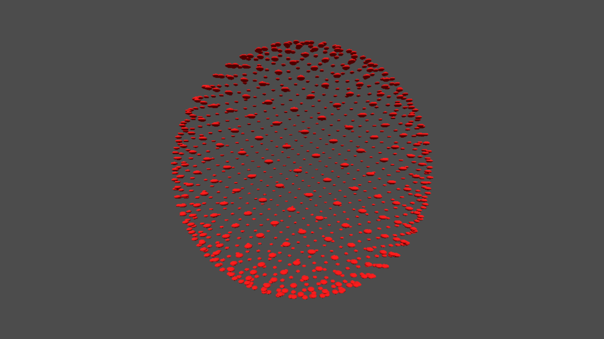
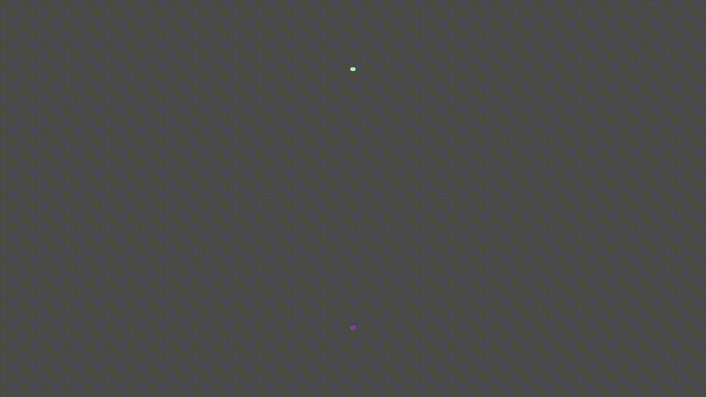

# Fibonacci Sphere (Godot-Rust)

This project is a simple component inspired by a visual from
[Sebastian Lague](https://www.youtube.com/@SebastianLague)'s YouTube video
[Coding Adventure: Procedural Moons and Planets](https://youtu.be/lctXaT9pxA0?si=KbSs0yUBbpt0uBQJ).

Specifically, at the start, when discussing algorithmic generation of points on
a sphere, Sebastian discusses about (and shows a rendered example of) a
[Fibonacci Lattice](https://observablehq.com/@meetamit/fibonacci-lattices),
which is "a visually and mathematically elegant method of distributing points on
a unit square, disk, or sphere".

## Progress

| Image                    | Description                                                                                                                                                                    |
| ------------------------ | ------------------------------------------------------------------------------------------------------------------------------------------------------------------------------ |
|  | The first implementation was a simple sphere.                                                                                                                                  |
|  | After some hacking, I was able to get camera controls and controllable points. However, I quickly noticed that computation for spherical points was extremely slow on the CPU. |


## Features

The following are current (and planned) features for this project:

- [x] The project renders a Fibonacci lattice.
- [x] Points are colored based on their positioning.
- [x] Input controls (`W`, `A`, `S`, and `D`) support smoothly (based on
      physics) orbiting the camera around the sphere. This is computed via
      simple physics, supporting clamped increases to rotational velocity. Input
      controls (`Q` and `E`) support moving closer or farther from the sphere.
- [x] Points are illuminated through a series of spotlights placed around the
      sphere.
- [x] Input controls (`Z` and `X`) support increasing and decreasing the number
      of points in real-time, clamped to maxima and minima.
- [x] When new points are added, their positions are interpolated to give the
      effect of points 'appearing' or 'bouncing' into view.

## Development

As with the prior project, to enable hot reloading:

```zsh
cargo install watchexec-cli
watchexec -c -w src -e rs "cargo build"
```

Additionally, if you have `godot4` or `godot` in your `PATH`, you can simply run
`godot4` in the `godot/` folder to launch the project immediately from the
command line.
